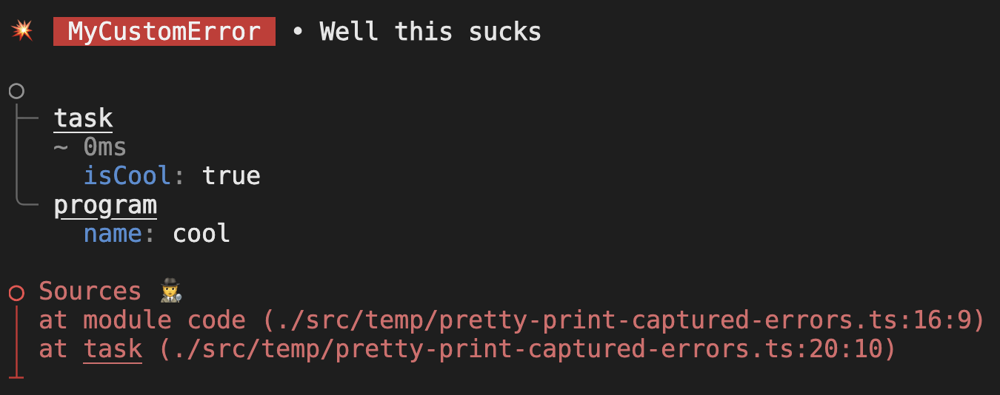

# effect-errors

[](https://github.dev/jpb06/effect-errors)


[](https://sonarcloud.io/summary/new_code?id=jpb06_effect-errors)
[](https://sonarcloud.io/dashboard?id=jpb06_effect-errors)
[](https://sonarcloud.io/dashboard?id=jpb06_effect-errors)
[](https://sonarcloud.io/dashboard?id=jpb06_effect-errors)
[](https://sonarcloud.io/dashboard?id=jpb06_effect-errors)
[](https://sonarcloud.io/summary/new_code?id=jpb06_effect-errors)
[](https://sonarcloud.io/summary/new_code?id=jpb06_effect-errors)
[](https://sonarcloud.io/dashboard?id=jpb06_effect-errors)
[](https://sonarcloud.io/summary/new_code?id=jpb06_effect-errors)
[](https://sonarcloud.io/summary/new_code?id=jpb06_effect-errors)
[](https://sonarcloud.io/dashboard?id=jpb06_effect-errors)

Some sort of POC to improve the way [Effect](https://effect.website/) reports errors in a dev env 🤔

<!-- readme-package-icons start -->

<p align="left"><a href="https://docs.github.com/en/actions" target="_blank"></a>&nbsp;<a href="https://www.typescriptlang.org/docs/" target="_blank"></a>&nbsp;<a href="https://nodejs.org/en/docs/" target="_blank"></a>&nbsp;<a href="https://bun.sh/docs" target="_blank"></a>&nbsp;<a href="https://babeljs.io/docs/en/" target="_blank"></a>&nbsp;<a href="https://biomejs.dev/guides/getting-started/" target="_blank"></a>&nbsp;<a href="https://esbuild.github.io/getting-started/#install-esbuild" target="_blank"></a>&nbsp;<a href="https://vitest.dev/guide/" target="_blank"></a>&nbsp;<a href="https://www.effect.website/docs/quickstart" target="_blank"></a></p>

<!-- readme-package-icons end -->


## ⚡ So how does it work?

Had to re-export `runSync` and `runPromise` to apply `prettyPrint` function on the cause returned by a `catchAll`.

So using it would look like this :

```typescript
import { runPromise } from 'effect-errors';

await runPromise(
  Effect.gen(function* () {
    // ...
  }),
);
```

You can also directly import the `prettyPrint` function to do whatever you want with it 🤷

```typescript
import { prettyPrint } from 'effect-errors';

await Effect.runPromise(
  pipe(
    Effect.gen(function* () {
      // ...
    }),
    Effect.sandbox,
    Effect.catchAll((e) => {
      console.error(prettyPrint(e));

      return Effect.fail('❌ runPromise failure');
    }),
  ),
);
```

Signature is the following:

```typescript
const prettyPrint: <E>(cause: Cause<E>, options?: PrettyPrintOptions) => string
```

`PrettyPrintOptions` allows you to tweak the following:

#### `enabled` - Whether pretty printing is enabled or not

> default: `true`

#### `stripCwd` - Whether spans and stacktrace should contain absolute or relative paths

> default: `false` (absolute paths)

#### `reverseSpans` - Whether spans order should reversed (entry point first instead of inner callee first)

> default: `true` (entry point first)

#### `hideStackTrace` - Whether node stacktrace should be displayed

> default: `true`

## ⚡ Pretty printing from captured errors

You can also use the function `prettyPrintFromCapturedErrors` to display errors from captured errors:

```ts
import { NodeFileSystem } from '@effect/platform-node';
import { Effect, pipe } from 'effect';
import { TaggedError } from 'effect/Data';

import { captureErrors, prettyPrintFromCapturedErrors } from 'effect-errors';

export class MyCustomError extends TaggedError('MyCustomError')<{
  cause?: unknown;
  message?: string;
}> {}

const task = pipe(
  Effect.fail(
    new MyCustomError({
      cause: 'Well this sucks',
    }),
  ),
  Effect.withSpan('task', {
    attributes: { isCool: true },
  }),
);

const program = pipe(
  task,
  Effect.sandbox,
  Effect.catchAll((e) =>
    Effect.gen(function* () {
      const errors = yield* captureErrors(e);
      const message = prettyPrintFromCapturedErrors(errors, {
        stripCwd: true,
        hideStackTrace: true,
        reverseSpans: true,
      });

      console.error(message);

      // Do something with the captured errors ...
    }),
  ),
  Effect.provide(NodeFileSystem.layer),
  Effect.withSpan('program', { attributes: { name: 'cool' } }),
);

Effect.runPromise(program);
```

The result would look like so:



## ⚡ How should I raise errors?

The best way is to use either `SchemaError` or `TaggedError`.

### 🔶 `SchemaError`

Declaring the error could look like this:

```typescript
import { Schema } from '@effect/schema';

export class FileNotFoundError extends Schema.TaggedError<SchemaError>()(
  'FileNotFound',
  {
    cause: Schema.Defect,
  },
) {}
```

You would then raise a `FileNotFoundError` to the error channel like this:

```typescript
Effect.tryPromise({
  try: () => ...,
  catch: (e) => new FileNotFoundError({ cause: e }),
});

// or raising directly
Effect.fail(new FileNotFoundError({ cause: "Oh no!" }));
```

### 🔶 `TaggedError`

```typescript
export class UserNotFoundError extends TaggedError('UserNotFound')<{
  cause?: unknown;
}> {}
```

You would then raise a `UserNotFoundError` to the error channel like this:

```typescript
Effect.tryPromise({
  try: () => ...,
  catch: (e) => new UserNotFoundError({ cause: e }),
});

// or raising directly
Effect.fail(new UserNotFoundError({ cause: "User does not exist" }));
```

### 🔶 Plain object

Alternatively, you _can_ use a plain object with a `_tag` and `message` attribute, but you won't get any stacktrace if you use this method:

```typescript
Effect.fail({ _tag: 'SucksToBeMe', message: 'Yeah...' });
```

## ⚡ Capturing errors data

You might want to apply your own logic to reported errors data; for example if you want to display errors in html. You can do so using `captureErrors`. The function has the following signature:

```typescript
export interface ErrorSpan {
  name: string;
  attributes: Record<string, unknown>;
  durationInMilliseconds: number | undefined;
  startTime: bigint;
  endTime: bigint | undefined;
}

export interface ErrorData {
  errorType: unknown;
  message: unknown;
  stack: string[] | undefined;
  sources: Omit<ErrorRelatedSources, '_tag'>[] | undefined;
  location: Omit<ErrorLocation, '_tag'>[] | undefined;
  spans: ErrorSpan[] | undefined;
  isPlainString: boolean;
}

export interface CapturedErrors {
  interrupted: boolean;
  errors: ErrorData[];
}

export interface CaptureErrorsOptions {
  reverseSpans?: boolean;
  stripCwd?: boolean;
}

const captureErrors: <E>(
  cause: Cause<E>, 
  options?: CaptureErrorsOptions
) => Effect.Effect<CapturedErrors, FsError, FileSystem>
```

You can use `captureErrors` like so:

```typescript
import { captureErrors } from 'effect-errors';
import { NodeFileSystem } from '@effect/platform-node';

await Effect.runPromise(
  pipe(
    effect,
    Effect.sandbox,
    Effect.catchAll((e) =>
      Effect.gen(function* () {
        const errors = yield* captureErrors(e);

        // ...
      }),
    ),
    Effect.provide(NodeFileSystem.layer),
  ),
);
```

Capturing errors from the [`from-promise` bundle](./src/tests/bundle/from-promise.js) would return something like this, for example:

```json
{
  "interrupted": false,
  "errors": [
    {
      "errorType": "FetchError",
      "message": {
        "code": "ConnectionRefused",
        "path": "https://yolo-bro-oh-no.org/users/123",
        "errno": 0
      },
      "stack": [
        "at new e (:1:28)",
        "at new <anonymous> (./src/tests/bundle/from-promise.js:31:85172)",
        "at new t (:1:28)",
        "at new Ga (:1:28)",
        "at catch (./src/tests/bundle/from-promise.js:37:352)",
        "at Sync (./src/tests/bundle/from-promise.js:31:39923)",
        "at runLoop (./src/tests/bundle/from-promise.js:31:42686)",
        "at evaluateEffect (./src/tests/bundle/from-promise.js:31:38196)",
        "at evaluateMessageWhileSuspended (./src/tests/bundle/from-promise.js:31:37872)",
        "at drainQueueOnCurrentThread (./src/tests/bundle/from-promise.js:31:35561)",
        "at run (./src/tests/bundle/from-promise.js:31:43020)",
        "at starveInternal (./src/tests/bundle/from-promise.js:31:6243)",
        "at processTicksAndRejections (:12:39)"
      ],
      "sources": [
        {
          "name": "FetchError",
          "runPath": "/Users/jpb06/repos/perso/effect-errors/src/tests/bundle/from-promise.js:37:352",
          "sourcesPath": "/Users/jpb06/repos/perso/effect-errors/src/examples/from-promise.ts:30:13",
          "source": [
            {
              "line": 27,
              "code": "      try: async () =>"
            },
            {
              "line": 28,
              "code": "        await fetch(`https://yolo-bro-oh-no.org/users/${userId}`),"
            },
            {
              "line": 29,
              "code": "      catch: (e) =>"
            },
            {
              "line": 30,
              "code": "        new FetchError({",
              "column": 13
            },
            {
              "line": 31,
              "code": "          cause: e,"
            },
            {
              "line": 32,
              "code": "        }),"
            },
            {
              "line": 33,
              "code": "    }),"
            }
          ]
        },
        {
          "name": "fetchTask",
          "runPath": "/Users/jpb06/repos/perso/effect-errors/src/tests/bundle/from-promise.js:37:213",
          "sourcesPath": "/Users/jpb06/repos/perso/effect-errors/src/examples/from-promise.ts:25:10",
          "source": [
            {
              "line": 22,
              "code": ");"
            },
            {
              "line": 23,
              "code": ""
            },
            {
              "line": 24,
              "code": "const fetchTask = (userId: string) =>"
            },
            {
              "line": 25,
              "code": "  Effect.withSpan('fetch-user', { attributes: { userId } })(",
              "column": 10
            },
            {
              "line": 26,
              "code": "    Effect.tryPromise({"
            },
            {
              "line": 27,
              "code": "      try: async () =>"
            },
            {
              "line": 28,
              "code": "        await fetch(`https://yolo-bro-oh-no.org/users/${userId}`),"
            }
          ]
        },
        {
          "name": "fromPromiseTask",
          "runPath": "/Users/jpb06/repos/perso/effect-errors/src/tests/bundle/from-promise.js:37:490",
          "sourcesPath": "/Users/jpb06/repos/perso/effect-errors/src/examples/from-promise.ts:44:39",
          "source": [
            {
              "line": 41,
              "code": "    }),"
            },
            {
              "line": 42,
              "code": "  );"
            },
            {
              "line": 43,
              "code": ""
            },
            {
              "line": 44,
              "code": "export const fromPromiseTask = Effect.withSpan('from-promise-task')(",
              "column": 39
            },
            {
              "line": 45,
              "code": "  Effect.gen(function* () {"
            },
            {
              "line": 46,
              "code": "    yield* filename(fileName);"
            },
            {
              "line": 47,
              "code": ""
            }
          ]
        }
      ],
      "spans": [
        {
          "name": "fromPromiseTask",
          "attributes": {},
          "durationInMilliseconds": 246
        },
        {
          "name": "fetchUser",
          "attributes": {
            "userId": "123"
          },
          "durationInMilliseconds": 239
        }
      ],
      "isPlainString": false
    }
  ]
}
```

If no map file is found, a `location` array will be returned instead of `sources`:

```json
{
  "interrupted": false,
  "errors": [
    {
      "errorType": "FetchError",
      "message": "request to https://yolo-bro-oh-no.org/users/1 failed, reason: getaddrinfo ENOTFOUND yolo-bro-oh-no.org",
      "stack": [
        "at catcher (file:///Users/jpb06/repos/remix-effect-errors/build/server/nodejs-eyJydW50aW1lIjoibm9kZWpzIn0/index.js?t=1729013117205.3699:2:14550)",
        "at EffectPrimitive.effect_instruction_i0 (file:///Users/jpb06/repos/remix-effect-errors/node_modules/effect/src/internal/core-effect.ts:1694:56)",
        "at body (file:///Users/jpb06/repos/remix-effect-errors/node_modules/effect/src/internal/fiberRuntime.ts:1113:41)",
        "at Object.effect_internal_function (file:///Users/jpb06/repos/remix-effect-errors/node_modules/effect/src/Utils.ts:780:14)",
        "at internalCall (file:///Users/jpb06/repos/remix-effect-errors/node_modules/effect/src/Utils.ts:784:22)",
        "at FiberRuntime.Sync (file:///Users/jpb06/repos/remix-effect-errors/node_modules/effect/src/internal/fiberRuntime.ts:1113:19)",
        "at f (file:///Users/jpb06/repos/remix-effect-errors/node_modules/effect/src/internal/fiberRuntime.ts:1347:53)",
        "at Object.context (file:///Users/jpb06/repos/remix-effect-errors/node_modules/effect/src/internal/tracer.ts:93:19)",
        "at FiberRuntime.runLoop (file:///Users/jpb06/repos/remix-effect-errors/node_modules/effect/src/internal/fiberRuntime.ts:1337:34)",
        "at FiberRuntime.evaluateEffect (file:///Users/jpb06/repos/remix-effect-errors/node_modules/effect/src/internal/fiberRuntime.ts:900:27)"
      ],
      "location": [
        {
          "filePath": "/build/server/nodejs-eyJydW50aW1lIjoibm9kZWpzIn0/index.js",
          "line": 2,
          "column": 14414
        },
        {
          "filePath": "/build/server/nodejs-eyJydW50aW1lIjoibm9kZWpzIn0/index.js",
          "line": 2,
          "column": 14703
        },
        {
          "filePath": "/build/server/nodejs-eyJydW50aW1lIjoibm9kZWpzIn0/index.js",
          "line": 2,
          "column": 17636
        }
      ],
      "spans": [
        {
          "name": "fetch-user",
          "attributes": {
            "userId": 1
          },
          "durationInMilliseconds": 52
        },
        {
          "name": "from-promise-task",
          "attributes": {},
          "durationInMilliseconds": 54
        },
        {
          "name": "promise-example-loader",
          "attributes": {
            "url": "http://localhost:3000/promise",
            "method": "GET",
            "body": null
          },
          "durationInMilliseconds": 55
        }
      ],
      "isPlainString": false
    }
  ]
}
```

## ⚡ examples

### 🔶 error logging - `runPromise` / `runSync`

I wrote some examples for fun and giggles. You can run them using:

```bash
bun run-examples
```

### 🔶 Custom display for errors - `captureErrors`

You can check this [example using remix error boundaries](https://github.com/jpb06/remix-effect-errors).
