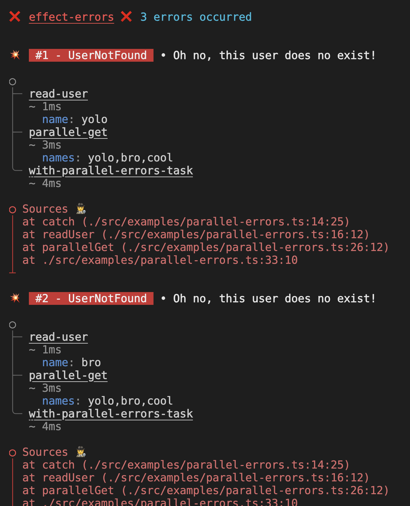

# effect-errors

<!-- readme-package-icons start -->

<p align="left"><a href="https://docs.github.com/en/actions" target="_blank"></a>&nbsp;<a href="https://www.typescriptlang.org/docs/" target="_blank"></a>&nbsp;<a href="https://nodejs.org/en/docs/" target="_blank"></a>&nbsp;<a href="https://bun.sh/docs" target="_blank"></a>&nbsp;<a href="https://github.com/motdotla/dotenv#readme" target="_blank"></a>&nbsp;<a href="https://eslint.org/docs/latest/" target="_blank"></a>&nbsp;<a href="https://prettier.io/docs/en/index.html" target="_blank"></a>&nbsp;<a href="https://www.effect.website/docs/quickstart" target="_blank"></a></p>

<!-- readme-package-icons end -->

Some sort of POC to improve the way [Effect](https://effect.website/) reports errors in a dev env 🤔



## ⚡ So how does it work?

Had to re-export `runSync` and `runPromise` to apply `prettyPrint` function on the cause returned by a `catchAll`.

So using it would look like this :

```typescript
import { runPromise } from 'effect-errors';

(async () => {
  await runPromise(
    Effect.gen(function* (_) {
      // ...
    }),
  );
})();
```

The fancy logging behavior is enabled if your node env is `development` or if you set `EFFECT_PRETTY_PRINT` env var to `true`.

You can also directly import the `prettyPrint` function to do whatever with it if you want 🤷

```typescript
import { prettyPrint } from 'effect-errors';

// ...
```

Signature is the following:

```typescript
const prettyPrint: <E>(cause: Cause<E>) => string;
```

## ⚡ How should I raise errors?

The best way is to use either `SchemaError` or `TaggedError`.

### 🔶 `SchemaError`

Declaring the error could look like this:

```typescript
import * as Schema from '@effect/schema/Schema';

export class FileNotFoundError extends Schema.TaggedError<SchemaError>()(
  'FileNotFound',
  {
    cause: Schema.optional(Schema.unknown),
  },
) {}
```

You would then raise a `FileNotFoundError` to the error channel like this:

```typescript
Effect.tryPromise({
  try: () => ...,
  catch: (e) => new FileNotFoundError({ cause: e }),
});

// or raising directly
Effect.fail(new FileNotFoundError({ cause: "Oh no!" }));
```

### 🔶 `TaggedError`

```typescript
export class UserNotFoundError extends TaggedError('UserNotFound')<{
  cause?: unknown;
}> {}
```

You would then raise a `UserNotFoundError` to the error channel like this:

```typescript
Effect.tryPromise({
  try: () => ...,
  catch: (e) => new UserNotFoundError({ cause: e }),
});

// or raising directly
Effect.fail(new UserNotFoundError({ cause: "User does not exist" }));
```

## ⚡ examples

I wrote some examples for fun and giggles. You can run them using:

```bash
bun run-examples
```
